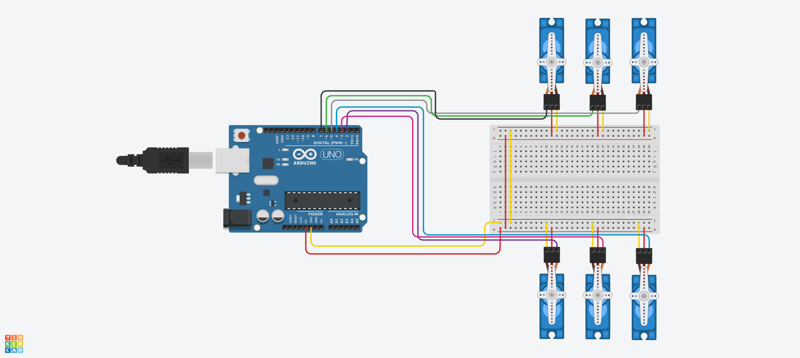

# 6-servo-sweep
- This Arduino project controls six servo motors to perform a coordinated sweeping motion for 2 seconds, then holds all servos at 90 degrees. The solution is designed to work in Tinkercad's simulation environment, making it perfect for testing humanoid robot leg movements before physical implementation.

